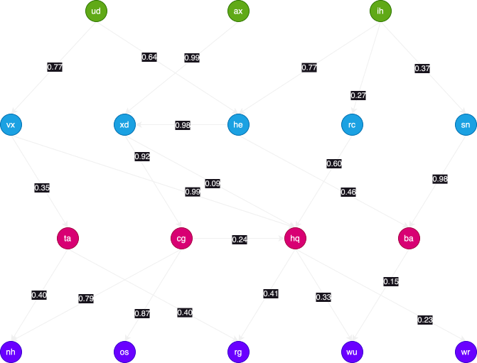

# Supply Chain Impact Investigation

In manufacturing, your success is often dependent on a complex supply chain of parts and
sub-assemblies. A failure in one part of the supply chain can have cascading effects on
the rest of the system. An event that impacts a single supplier can affect a wide range
of producers that relies on just-in-time delivery of parts.

You are given a directed graph representing a supply chain. Each node in the graph
represents a **supplier**, and each directed edge from node A to node B indicates that
supplier A provides parts to supplier B. Each edge has an associated impact value,
representing the severity of an event affecting that supplier (a value between 0 and 1).
The impact can then propagate through the supply chain based on the
**product of impact values along the directed edges**.

# Contents

- [Example Supply Chain](#example-supply-chain)
- [Commercial Requirements](#commercial-requirements)
- [Existing Framework](#existing-framework)
- [Working Examples](#working-examples)
    - [`POST /event-impact`](#post-event-impact)
    - [`POST /highest-impact`](#post-highest-impact)

## Example Supply Chain

You have been given a small example graph to illustrate and build your solution around.
This is in the form of a JSON file called `take-home-example.json`. It consists of a
dictionary of the following schema:

```json
{
  "ud": {
    "index": "ud",
    "neighbours": [
      {
        "impact": 0.77,
        "index": "vx"
      },
      {
        "impact": 0.64,
        "index": "he"
      }
    ]
  },
    "vx": {
    "index": "vx",
    "neighbours": [
      {
        "impact": 0.35,
        "index": "ta"
      },
      {
        "impact": 0.99,
        "index": "hq"
      }
    ]
  }
}
```

In the above example, each key (e.g. `ud`, `vx`) represents a supplier node in the graph.
Each node contains the following fields:

- `index`: A unique identifier for the supplier, which is guaranteed to match the key.
- `neighbours`: A list of dictionaries, each representing a directed edge to a neighbouring
  supplier. Each dictionary contains:
  - `impact`: A float value between `0` and `1` representing the impact of the event on the neighbouring supplier.
  - `index`: The unique identifier of the neighbouring supplier.

So in our case,

- Since the relationship exists for
    - `ud -[0.77]-> vx -> [0.35]-> ta`
- Then the impact on `ta` from `ud` would be `0.77 * 0.35 = 0.2695`.

When the whole graph is plotted, it looks like this:



This is a simplified example, and real-world supply chains can be much larger and more complex, and may include cycles, multiple paths between nodes, and varying impact values.

## Commercial Requirements

To serve our clients needs, we need to build an API that can:

- initialize with a static supply chain graph from a JSON file, and
- listen on two endpoints:
    - `POST /event-impact`
        - Given a list of **suppliers impacted by an event** and a list of
        **tracked suppliers**, return **all the tracked suppliers** that are affected by the event, _and_ their respective impact scores being above a given minimum impact threshold.
        - **Request Body**
          ```json
          {
            "impactedByEvent": ["supplier_index_1", "supplier_index_2", ...],
            "trackedSuppliers": ["supplier_index_3", "supplier_index_4", ...],
            "minImpact": 0.2
          }
          ```
        - **Response Body**
            ```json
            {
              "affectedSuppliers": [
                "supplier_index_3"
              ]
            }
            ```
    - `POST /highest-impact`
        - Given a list of **suppliers impacted by an event** and a list of
        **tracked suppliers**, return the **path of highest impact** and its resultant
        ***impact score** for each *tracked supplier** , if any.
        - **Request Body**
          ```json
          {
            "impactedByEvent": ["supplier_index_1", "supplier_index_2", ...],
            "trackedSuppliers": ["supplier_index_3", "supplier_index_4", ...]
          }
          ```
        - **Response Body**
            ```json
            {
              "highestImpacts": {
                "supplier_index_3": {
                    "path": ["supplier_index_1", "supplier_index_3"],
                    "impact": 0.2345
                },
                "supplier_index_4": {
                    "path": ["supplier_index_1", "supplier_index_5", "supplier_index_4"],
                    "impact": 0.1234
                }
              }
            }
            ```

## Existing Framework

Some boilerplate code has been provided to help you get started:

- `docker-compose.yml`: A Docker Compose file to help you build and run the application in a containerized environment.
- `Dockerfile`: A Dockerfile to build the application image.
- `src/supply_chain_network/__init__.py`: The main file containing the FastAPI application with the two endpoints already defined.
- `src/supply_chain_network/models.py`: Pydantic models for request and response bodies.

> [!NOTE]
> You are not required to use the provided boilerplate code, and are free to structure your code as you see fit.
> However, doing so might save you some time in setting up the application and allow you to focus more on the core logic of the problem,
> which is what we are primarily interested in evaluating.

To start the application, you can use the following commands:

```bash
docker compose up --build
```

Upon start up, the application will load the supply chain data from the specified JSON file
and initialize the graph structure in memory. You can see the logs in the console to confirm that
the application has started successfully:

```text
backend-interview-supply-chain-api-1  | Supply chain network loaded with 17 nodes
```

And you should be able to view the API documentation at `http://localhost:8080/docs`.

The `docker compose` accepts a Environment Variable called `SUPPLY_CHAIN_DATA_FILE`, to specify
the file name of the supply chain data JSON file to be used. If not provided, it defaults to
`take-home-example.json`. It expects the file to be located in the `supply_chain_data/` folder;
but for whatever reason you may also choose to provide an absolute path instead.

**In the live evaluation interview, you will be asked to load a different supply chain data file**,
which can be done by setting the `SUPPLY_CHAIN_DATA_FILE` environment variable when starting
the application:

```bash
SUPPLY_CHAIN_DATA_FILE=provided-file.json docker compose up --build
```

### Dev Tools

A very minimal set of dev tools have been provided to help you get started, such as `pre-commit` hooks with `ruff` for linting. You can install the pre-commit hooks by running:

```bash
pip install -e ".[dev]"
pre-commit install
```

Then whenever you make a commit, `ruff` will automatically check your code for linting issues.

## Working Examples

The following working examples are based on the **example JSON file** to illustrate the
expected behavior of the two endpoints, and the calculations involved.

### `POST /event-impact`

Assuming that the following request is made:

```json
{
  "impactedByEvent": ["ud", "ax", "ih"],
  "trackedSuppliers": ["wu", "wr"],
  "minImpact": 0.2
}
```

This is the classic use case on this layered graph - to have an event impacting all the
top level suppliers, and to see which of the bottom level suppliers are affected.

#### Route to `wu`

Walking through the graph, we can see that the following routes are available:

- `ud -[0.64]-> he -[0.98]-> xd -[0.92]-> cg -[0.24]-> hq -[0.33]-> wu` = `0.64 * 0.98 * 0.92 * 0.24 * 0.33 = 0.0457003008`
- `ax -[0.99]-> xd -[0.09]-> hq -[0.33]-> wu` = `0.99 * 0.09 * 0.33 = 0.029403`
- `ax -[0.99]-> xd -[0.92]-> cg -[0.24]-> hq -[0.33]-> wu` = `0.99 * 0.92 * 0.24 * 0.33 = 0.07213536`
- `ih -[0.77]-> he -[0.46]-> ba -[0.15] -> wu` = `0.77 * 0.46 * 0.15 = 0.05313`
- ...and more.

None of these paths yield an impact score above the minimum threshold of `0.2`, except:

- `ud -[0.77]-> vx -[0.99]-> hq -[0.33]-> wu` = `0.77 * 0.99 * 0.33 = 0.251559`

Since this is above the threshold, `wu` is included in the response.

> [!TIP]
> Note that even though there are multiple paths to `wu`, we only need one path
> that yields an impact score above the threshold for it to be included in the
> response.

> [!TIP]
> We only need 1 of the impacted suppliers to reach the tracked supplier for it to be
> considered affected. In this case, whether the paths from `ax` or `ih` reach `wu`
> with sufficient impact is irrelevant, since `ud` already does.

#### Route to `wr`

Tracing backwards, `wr` is only reachable from `hq`, a relationship with an impact score
of `0.23`, which does not allow for a lot of leeway to reach the minimum impact of
`0.2`.

Out of all the paths, the highest impact path is:

- `ud -[0.77]-> vx -[0.99]-> hq -[0.23]-> wr` = `0.77 * 0.99 * 0.23 = 0.175329`

Which is below the minimum impact threshold, so `wr` is not included in the response.

The final response is therefore:

```json
{
  "affectedSuppliers": ["wu"]
}
```

However, if the request were to be changed to omit `ud` from the impacted suppliers:

```json
{
  "impactedByEvent": ["ax", "ih"],
  "trackedSuppliers": ["wu", "wr"],
  "minImpact": 0.2
}
```

Then the highest impact paths to `wu` and `wr` would be:

- `ax -[0.99]-> xd -[0.92]-> cg -[0.24]-> hq -[0.33]-> wu` = `0.99 * 0.92 * 0.24 * 0.33 = 0.07213536`
- `ax -[0.99]-> xd -[0.92]-> cg -[0.24]-> hq -[0.23]-> wr` = `0.99 * 0.92 * 0.24 * 0.23 = 0.05027616`

Both of which are below the minimum impact threshold, resulting in an empty response:

```json
{
  "affectedSuppliers": []
}
```

> [!NOTE]
> To save your time, there is no defined requirements for how to handle invalid input.
> You may assume that all inputs are valid.

### Test Input

To assist your testing, here are some additional test inputs and expected outputs based on the example graph.

> [!NOTE]
> `affectedSuppliers` is treated as a set, so the order of suppliers does not matter.

#### Example 1

**Request Body**

```json
{
  "impactedByEvent": ["ud", "ax", "ih"],
  "trackedSuppliers": ["nh", "os", "rg", "wu", "wr"],
  "minImpact": 0.1
}
```

**Response Body**

```json
{
  "affectedSuppliers": ["nh", "os", "rg", "wu", "wr"]
}
```

#### Example 2

```json
{
  "impactedByEvent": ["ud", "ax", "ih"],
  "trackedSuppliers": ["nh", "os", "rg", "wu", "wr"],
  "minImpact": 0.3
}
```

**Response Body**

```json
{
  "affectedSuppliers": ["nh", "os", "rg"]
}
```

#### Example 3

**Request Body**

```json
{
  "impactedByEvent": ["ud", "ax", "ih"],
  "trackedSuppliers": ["nh", "os", "rg", "wu", "wr"],
  "minImpact": 0.7
}
```

**Response Body**

```json
{
  "affectedSuppliers": ["nh", "os"]
}
```

#### Example 4

**Request Body**

```json
{
  "impactedByEvent": ["ta", "xd", "rc", "he"],
  "trackedSuppliers": ["rg", "os", "nh", "ba", "ud", "sn"],
  "minImpact": 0.4
}
```

**Response Body**

```json
{
  "affectedSuppliers": ["rg", "os", "nh", "ba"]
}
```

> [!NOTE]
> Note that `ud` and `sn` are not affected since they are upstream of the impacted suppliers.

#### Example 5

**Request Body**

```json
{
  "impactedByEvent": ["ta", "xd", "rc", "he"],
  "trackedSuppliers": ["rg", "os", "nh", "ba", "ud", "sn"],
  "minImpact": 0.6
}
```

**Response Body**

```json
{
  "affectedSuppliers": ["os", "nh"]
}
```

> [!NOTE]
> The highest impact path to `rg` and `ba` are `0.4` and `0.46` respectively, which are
> below the minimum impact threshold of `0.6`.


### `POST /highest-impact`

Assuming that the following request is made:

```json
{
  "impactedByEvent": ["ud", "ax", "ih"],
  "trackedSuppliers": ["wu", "wr", "os"]
}
```

#### Route to `wu`

We have already investigated the paths from the impacted suppliers to `wu` and `wr` in the previous section:

- `ud -[0.77]-> vx -[0.99]-> hq -[0.33]-> wu` = `0.77 * 0.99 * 0.33 = 0.251559`
- `ud -[0.64]-> he -[0.98]-> xd -[0.92]-> cg -[0.24]-> hq -[0.33]-> wu` = `0.64 * 0.98 * 0.92 * 0.24 * 0.33 = 0.0457003008`
- `ax -[0.99]-> xd -[0.09]-> hq -[0.33]-> wu` = `0.99 * 0.09 * 0.33 = 0.029403`
- `ax -[0.99]-> xd -[0.92]-> cg -[0.24]-> hq -[0.33]-> wu` = `0.99 * 0.92 * 0.24 * 0.33 = 0.07213536`
- `ih -[0.77]-> he -[0.98]-> xd -[0.92]-> cg -[0.24]-> hq -[0.33]-> wu` = `0.77 * 0.98 * 0.92 * 0.24 * 0.33 = 0.0549831744`
- `ih -[0.77]-> he -[0.98]-> xd -[0.09]-> hq -[0.33]-> wu` = `0.77 * 0.46 * 0.09 * 0.33 = 0.01051974`
- `ih -[0.77]-> he -[0.46]-> ba -[0.15] -> wu` = `0.77 * 0.46 * 0.15 = 0.05313`
- `ih -[0.27]-> rc -[0.60]-> hq -[0.33]-> wu` = `0.27 * 0.60 * 0.33 = 0.05346`
- `ih -[0.37]-> sn -[0.98]-> ba -[0.15]-> wu` = `0.37 * 0.98 * 0.15 = 0.05439`

Out of all these, the path from `ud` yields the highest impact:

- `ud -[0.77]-> vx -[0.99]-> hq -[0.33]-> wu` = `0.77 * 0.99 * 0.33 = 0.251559`

Since we only need to know the highest impact path for each tracked supplier from
**any** of the impacted suppliers, we only need to return this path from `ud`:

```json
{
  "path": ["ud", "vx", "hq", "wu"],
  "impact": 0.251559
}
```

#### Route to `wr`

Similarly, the highest impact path to `wr` is also from `ud`:

- `ud -[0.77]-> vx -[0.99]-> hq -[0.23]-> wr` = `0.77 * 0.99 * 0.23 = 0.175329`

#### Route to `os`

`os` is indeed reachable from all three impacted suppliers, but there is a clear
highest impact path from `ax`:

- `ax -[0.99]-> xd -[0.92]-> cg -[0.87]-> os` = `0.99 * 0.92 * 0.87 = 0.792396`


The final response is therefore:

```json
{
  "highestImpacts": {
    "wu": {
      "path": ["ud", "vx", "hq", "wu"],
      "impact": 0.251559
    },
    "wr": {
      "path": ["ud", "vx", "hq", "wr"],
      "impact": 0.175329
    },
    "os": {
      "path": ["ax", "xd", "cg", "os"],
      "impact": 0.792396
    }
  }
}
```

### Test Input

To assist your testing, here are some additional test inputs and expected outputs based on the example graph.

#### Example 1

**Request Body**

```json
{
  "impactedByEvent": ["ud", "ax", "ih"],
  "trackedSuppliers": ["nh", "os", "rg", "wu", "wr"]
}
```

**Response Body**

```json
{
  "highestImpacts": {
    "nh": {
      "path": ["ax", "xd", "cg", "nh"],
      "impact": 0.719532
    },
    "os": {
      "path": ["ax", "xd", "cg", "os"],
      "impact": 0.792396
    },
    "rg": {
      "path": ["ud", "vx", "hq", "rg"],
      "impact": 0.312543
    },
    "wu": {
      "path": ["ud", "vx", "hq", "wu"],
      "impact": 0.251559
    },
    "wr": {
      "path": ["ud", "vx", "hq", "wr"],
      "impact": 0.175329
    }
  }
}
```

#### Example 2

**Request Body**

```json
{
  "impactedByEvent": ["ta", "xd", "rc", "he"],
  "trackedSuppliers": ["rg", "os", "nh", "ba", "ud", "sn"]
}
```

**Response Body**

```json
{
  "highestImpacts": {
    "os": {
      "path": [
        "xd",
        "cg",
        "os"
      ],
      "impact": 0.8004
    },
    "rg": {
      "path": [
        "ta",
        "rg"
      ],
      "impact": 0.4
    },
    "nh": {
      "path": [
        "xd",
        "cg",
        "nh"
      ],
      "impact": 0.7268
    },
    "ba": {
      "path": [
        "he",
        "ba"
      ],
      "impact": 0.46
    }
  }
}
```

#### Example 3

**Request Body**

```json
{
  "impactedByEvent": ["ta", "sn", "he"],
  "trackedSuppliers": ["rg", "wu", "nh", "he"]
}
```

**Response Body**

```json
{
  "highestImpacts": {
    "rg": {
      "path": ["ta", "rg"],
      "impact": 0.4
    },
    "wu": {
      "path": ["sn", "ba", "wu"],
      "impact": 0.147
    },
    "nh": {
      "path": ["he", "xd", "cg", "nh"],
      "impact": 0.712264
    },
    "he": {
      "path": ["he"],
      "impact": 1.0
    }
  }
}
```

> [!NOTE]
> Note that `he` has an impact of `1.0` since it is directly impacted by the event;
> it is a valid request to track suppliers that are also directly impacted.
